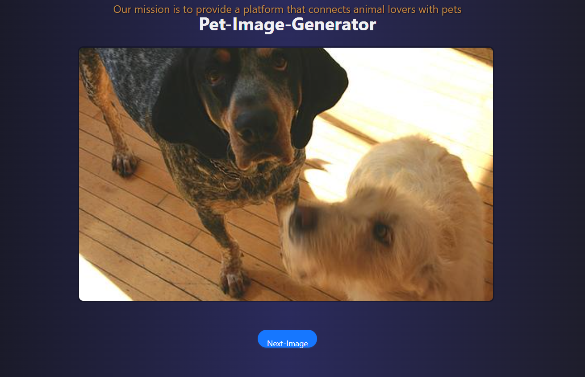

# Pet Image Generator

Introducing an pet image generator for all pet lovers out there. You can use this tool to get lots of cute pictures of your favourite pet.



## Visit our site [Pet-Image](https://dog-img-generator.vercel.app)


## 🚀 How to Contribute

We appreciate your contributions to make this repository better! Here's how you can contribute:

### 1. Create an Issue

If you encounter issues with the existing code, or if you have suggestions for improvements, please create an issue. Please provide desciptions about your suggestions or bugs

### 2. Fork and Clone

To start contributing, fork this repository to your GitHub account, and then clone it to your local machine.

```bash
git clone https://github.com/Astro-bearr/Dog-img-generator.git
```

### 3. Create a New Feature Branch
Before making changes, create a new branch for your feature or bug fix.

```bash
git checkout -b feature-name
```

### 4. Make Changes and Commit
Commit you changes to the newly created branch.

### 5. Create a Pull Request
Once you've made your changes and pushed them to your forked repository, create a pull request to merge your changes into the main repository.
